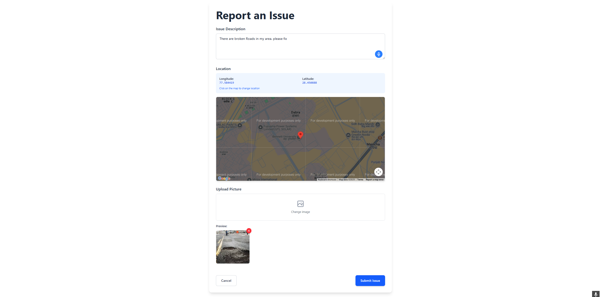
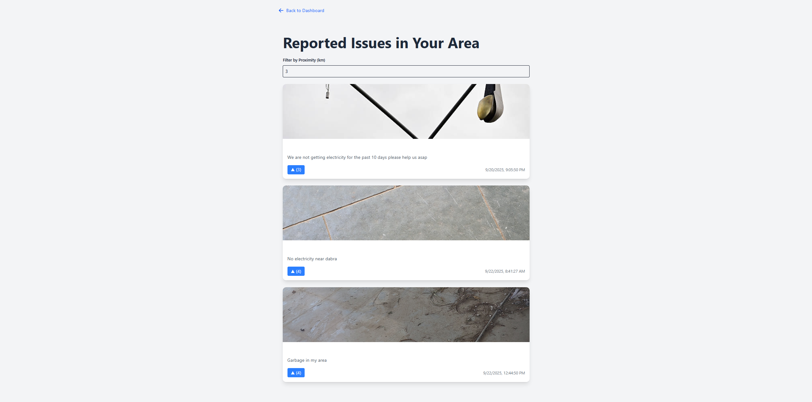
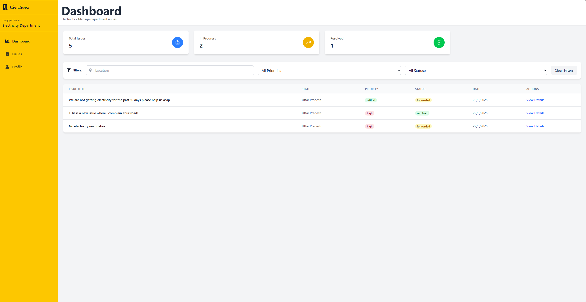
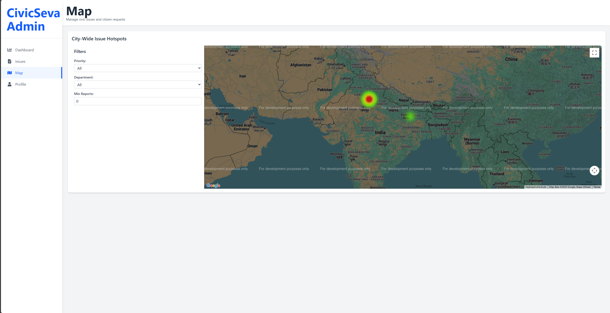
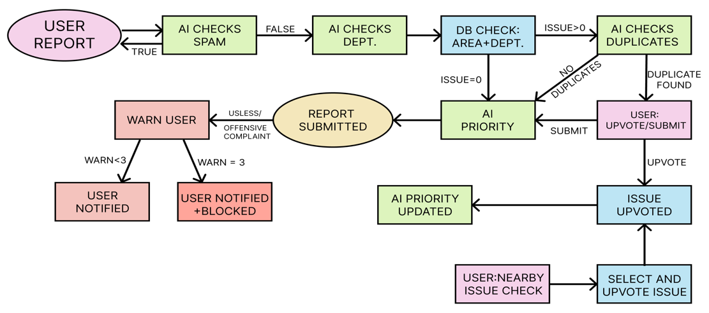

#  CivicSewa - CrowdSource Issue Reporting Portal

[](https://creativecommons.org/licenses/by-nc-nd/4.0/)

##  Tech Stack  
[](https://skillicons.dev)
---

> A full-stack web application for reporting and tracking local issues, facilitating communication between the public and relevant authorities.

---


##  About the Project

**CivicSewa** is a platform designed to bridge the gap between citizens and local authorities. It provides a user-friendly interface for reporting civic issues such as potholes, broken streetlights, and waste management problems. By crowdsourcing this information, the application aims to improve the efficiency of issue resolution and enhance community engagement.

### Key Objectives

-   To provide a centralized platform for reporting and tracking local issues.
-   To improve transparency and accountability in the issue resolution process.
-   To facilitate better communication between the public and government departments.
-   To empower citizens to take an active role in improving their communities.
-   To reduce manual labor and automate most processes.

---

##  Features

-   **User Authentication**: Secure user registration and login system.
-   **Issue Reporting**: Users can report issues with details like location, description, and images.
-   **Interactive Map**: A map-based visualization of reported issues using the Google Maps API.
-   **Role-Based Dashboards**: Separate dashboards for users, department officials, and administrators with role-specific functionalities.
- **Local Reported Issues**: User can see issues reported in their area and upvote those to show support to that issue
- **Duplication Detection**: If duplicate of any issue is detected in the same area (using AI) then user gets option to upvote that instead .(This saves storage space)
- **Smart Detection**: AI model checks for SPAM , Automatically gets the department for that issue , Automatically assigns priority based on the severity of the issue
-   **Real-time Issue Tracking**: Users can track the status of their reported issues in real-time.
-   **Admin Panel**: Admins can manage users, view all reported issues, and assign them to the relevant departments.
-   **Department Panel**: Departments can view, update, and resolve the issues assigned to them.
-   **Email Notifications**: Automated email notifications for status updates on reported issues.

---

##  Tech Stack

### Frontend

-   **React**: A JavaScript library for building user interfaces.
-   **React Router**: For client-side routing.
-   **Tailwind CSS**: A utility-first CSS framework.
-   **Axios**: For making HTTP requests to the backend.
-   **Vite**: A modern frontend build tool.

### Backend

-   **Node.js**: A JavaScript runtime environment.
-   **Express.js**: A web application framework for Node.js.
-   **MongoDB**: A NoSQL database for storing application data.
-   **Mongoose**: An ODM library for MongoDB.
-   **JSON Web Tokens (JWT)**: For user authentication and authorization.
-   **Cloudinary**: For cloud-based image management.
-   **Nodemailer**: For sending emails.

---
## 📸 Screenshots

<details>
  <summary> User Report Page</summary>
  
</details>

<details>
  <summary> Nearby Reported Issues</summary>
  
</details>

<details>
  <summary> Department Dashboard</summary>
  
</details>

<details>
  <summary> Admin Heatmap page</summary>
  
</details>

---
## Workflow


User WorkFlow Diagram
---

##  Getting Started

To get a local copy up and running, follow these simple steps.

### Prerequisites

-   Node.js and npm installed on your machine.
-   A MongoDB database (local or cloud-based).
-   A Cloudinary account for image storage.

### Installation

1.  **Clone the repository**:
    ```sh
    git clone https://github.com/ishandeep48/CrowdSource_Issue.git
    ```
2.  **Navigate to the project directory**:
    ```sh
    cd CrowdSource_Issue
    ```
3.  **Install frontend dependencies**:
    ```sh
    cd CrowdSource
    npm install
    ```
4.  **Install backend dependencies**:
    ```sh
    cd ../BackEnd
    npm install
    ```
5.  **Set up environment variables**:
    Create a `.env` file in the `BackEnd` directory and add the following variables:
    ```
    DB_CONNECTION_STRING=<your_mongodb_connection_string>
    SECKEY=<your_jwt_secret>
    CLOUD_NAME=<your_cloudinary_cloud_name>
    CLOUD_KEY=<your_cloudinary_api_key>
    CLOUD_SECRET=<your_cloudinary_api_secret>
    EMAIL=<your_email_address>
    PASS=<your_app_password>
    ```

---

## Usage

1.  **Start the backend server**:
    ```sh
    cd BackEnd
    node index.js
    ```
2.  **Start the frontend development server**:
    ```sh
    cd ../CrowdSource
    npm run devS
    ```
3.  Open your browser and navigate to `http://localhost:5173`.


---

##  Contributing

Contributions are welcome! If you have any ideas, suggestions, or bug reports, please open an issue or create a pull request.

1.  **Fork the Project**
2.  **Create your Feature Branch** (`git checkout -b feature/AmazingFeature`)
3.  **Commit your Changes** (`git commit -m 'Add some AmazingFeature'`)
4.  **Push to the Branch** (`git push origin feature/AmazingFeature`)
5.  **Open a Pull Request**


---

##  License


    CivicSewa  © 2025 by Ishan Deep is licensed under CC BY-NC-ND 4.0. To view a copy of this license, visit https://creativecommons.org/licenses/by-nc-nd/4.0/


---

## Team Members 

*Ishan Deep (ishandeep48)
*Atmika Khandelwal (Amii2410)
*Anusha Singh (Crystlfly)
*Shreya Anand (heheshreya)
*Kritika Mishra (itzkritz)
*Harshit Batra (N1CK99925)

---

##  Contact

Ishan Deep - [ishandeep48@gmail.com](mailto:ishandeep48@gmail.com)

Project Link: [https://github.com/ishandeep48/CrowdSource_Issue](https://github.com/ishandeep48/CrowdSource_Issue)
